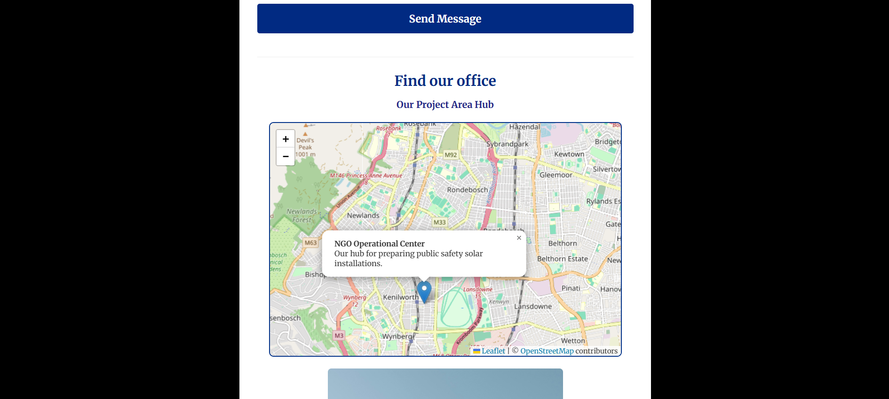

# ST10522074_WEDE5020_POE
Rosebank College WEDE assignment
https://github.com/JujuRC/ST10522074_WEDE5020_POE
https://jujurc.github.io/ST10522074_WEDE5020_POE/

This is the HTML code for the Knightly Website. at a later date I will be adding the Css and JavaScript to make the site more appealing to our target audience. This website is being made to solve the lack of website credibilty and online presence. We hope thi website will help reach those in need of our cause as well as people to help widen our reach.

Work of : Justine Bakundukize, ST10522074.

Status: Underconstruction , however HTML skeleton is complete.

____________________________________________________________________________________________

## Overview

Founded in 2026, KNIGHTLY is an NGO focused on nightly protection within neighbourhoods and areas providing additional lights and cameras in public areas, for public protection.We use solar panels for our lights and in collaboration with the government aim to get as many lights up and cameras up as possible to help crack down on violence and crimes. 

This was prompted by the increase of violent crimes at night or especially during loadshedding. Due to the increase of violence in South Africa and the increase of violent crimes that go unsolved. Our founders grew up in Delft, where most streets had one light on or no lights, where crimes occurred either in the early mornings or in the late evenings where it is difficult to see. For the large amounts of South Africans who take public transport in the mornings or have to walk down from main roads from taxis in the evenings. Our goal is to provide some sort of protection for them, and if what we do isn't enough to save a belonging or a life we would like to at least ensure that Justice is served, whether it is returning the belonging, catching the thief or finally letting a soul rest. Our goal is to reduce crime. We aim to reach all of south Africa , but most importantly commuters, people in unsafe neighborhoods as well as to reach more funders, public protection groups as well as aim to continue our government collaborations.

____________________________________________________________________________________________

## wireframes
The following wireframes are designed to prioritize a user-friendly layout.

____________________________________________________________________________________________

## the Site

### Website features and functionality:
+ Home page - introduction to the NGO and highlights the amount of crime in south Africa and our goal. 
+ Projects page - Future project and where we have already put up lights.
+ Protect yourself - How you can stay safe while out at night.
+ About - Our history 
+ Contact us page - contact details
+ Mobile first responsiveness 
+ Social Media Links

### Design 

+ Colours:Shades of dark blues, Black and White 
+ Fonts : Noto Sans, Merriweather,Playfair

____________________________________________________________________________________________

## Roadmap

### Phase 1: Foundation (In Progress)
- [x] Create project proposal and wireframes
- [x] Set up repository and file structure
- [x] Build semantic HTML skeleton for all pages
- [x] Ensure ARIA labels and accessibility standards

### Phase 2: Styling & UI
- [x] Implement global CSS variables (colors/fonts)
- [x] Design responsive navigation menu
- [x] Build layout using CSS Grid/Flexbox
- [x] Add transitions and hover effects

### Phase 3: Functionality
- [x] Add JavaScript for form handling
- [x] Implement interactive components (e.g., modals or tabs)
- [x] Domain application 
____________________________________________________________________________________________
## Features & Implementation: Phase 2

### 1. Unified Base Style & Reset
* Implemented a comprehensive universal CSS box-sizing reset to ensure identical structural layout rendering across all major browsers (Chrome, Safari, Firefox, Edge).
* Centralized scrolling mechanics and page overflows securely on the global root layers to prevent layout clipping.

### 2. Typographic Harmony
* Established an elegant visual hierarchy using pairing typography: **Playfair Display** for classic, high-impact editorial headings, paired with **Merriweather** for incredibly crisp, readable body copy and list elements.

### 3. Structured Layouts (Flexbox)
* Built entirely dynamic, container-based layouts utilizing CSS Flexbox rows and columns.
* Features sleek "full-bleed" layout rows on the Projects showcase where imagery locks seamlessly flush against the grid walls.
* Created a clean, responsive card-based layout for user interaction on the Contact page.

### 4. Interactive States
* Implemented smooth, animated transitions (`0.3s ease`) across all interactive touchpoints.
* Covered complete user accessibility by custom styling `:hover`, `:focus-visible` (for keyboard navigation), and tactile `:active` scaling effects on all navigation links and form buttons.

### 5. Full Mobile Responsiveness
* Engineered defensive `@media` queries optimizing the entire platform for mobile phones and tablets (breakpointed at `768px`).
* Media layers seamlessly transition rigid desktop horizontal rows into stacked, thumb-friendly vertical columns with dynamic font down-scaling.

## Tech Stack Used
* **HTML5:** Semantic architecture (`<header>`, `<nav>`, `<section>`, `<article>`, `<form>`)
* **CSS3:** Custom Flexbox layouts, advanced positioning layers, CSS transitions, and Media Queries
* **Google Fonts:** Playfair Display & Merriweather

____________________________________________________________________________________________
## Features & Implementation: Phase 3

### 1. Interactive Elements: FAQ Accordion (about.html)
* A custom-built accordian system designed to organize frequently asked questions efficiently without overwhelming the layout.
* Uses document.querySelectorAll() to attach asynchronous click event listeners to targeted interactive triggers (.but).
* Upon interaction, the DOM utilizes element navigation (this.nextElementSibling) to toggle a state-driven .active CSS class, smoothly revealing or collapsing hidden target panels (.ans).

### 2. Form Functionality & Client-Side Validation (contact.html)
* An asynchronous validation engine that intercepts general organization queries to verify input integrity before submission.
* Captures the form's submit event and overrides traditional page refreshes using event.preventDefault().
* Automatically extracts and evaluates user data parameters (verifying name length, checking email structures for "@" syntax constraints, enforcing minimum message lengths, and ensuring selection choices are populated).
* Injects contextual status alerts into the UI interface using real-time DOM styling manipulation based on successful or failed criteria checks.

### 3. Asynchronous Submission Simulation (AJAX)
* Implements seamless frontend data processing without disruptive page reloads to match modern UX application standards.
* Simulates standard web service response structures through a setTimeout() execution wrapper. 
* Once client criteria pass, it compiles structural inputs cleanly into URI-encoded fragments, automatically bridging the data directly.

## Tech Stack Used 
* **Vanilla JavaScript (ES6+):** Used to handle the interactive accordion logic, catch form submissions, run client-side input validation, and simulate asynchronous AJAX workflows.
* **CSS3:** Custom Flexbox layouts, advanced positioning layers, CSS transitions, and Media Queries
____________________________________________________________________________________________
## Usage

Clone the repo: git clone [https://github.com/JujuRC/ST10522074_WEDE5020_POE]
Navigate to the project folder.
Open index.html in your preferred web browser.

____________________________________________________________________________________________

## Technical Focus
Semantic HTML5: high priority on using meaningful tags to ensure the site is accessible for screen readers and optimized for SEO. Mobile-First Intent, although currently in the skeleton phase, the structure is built to transition easily into a responsive CSS layout.

_____________________________________________________________________________________________

## Responsive testing 

+ Desktop 

+ Mobile 

_______________________________________________________________________________________________

## References

Afrihost. 2026. Domains. [Online]. Available at: https://www.afrihost.com/domains 
[Accessed 13 April 2026]. 

Bolwa.2025. Which Areas in South Africa Need Security Most? 2026 Crime Data Reveals 
Shocking Trends. [Online] Available at:  https://bolwasecurityservices.co.za/which
areas-in-south-africa-need-security-most-2025-crime-data-reveals-shocking-trends/ 
[Accessed 13 April 2026]. 

CCTC Direct.2004. Security Camera’s. [Online]. Available at: https://cctv
direct.co.za/collections/security-camera-s?srsltid=A [Accessed 13 April 2026]. 

City of Cape Town.2015. Regulation of external and privately owned CCTV cameras on 
city property policy. [Online]. Available at: 
https://resource.capetown.gov.za/documentcentre/Documents/ [Accessed 13 April 
2026]. 

Color-hex.2023. Dark Blue Color Palette. [Online]. Available at: https://www.color
hex.com/color-palette/8228 [Accessed 13 April 2026]. 

Cottonbro studio.2021. A person holding a light sphere. [Online]. Available at: 
https://www.pexels.com/photo/a-person-holding-a-light-sphere-7170873/ [Accessed 
13 April 2026]. 

Cottonbro studio.2021. [Online]. A 3D illustration of a handshake. Available at: A 3D 
Illustration of a Handshake · Free Stock Photo [Accessed 28 April 2026]. 

Mozilla. <Name-color> CSS type. [Online]. Available at: https://developer.mozilla.org/ [Accessed 30 May 2026].

Figma.2016. Black. [Online]. Available at: https://www.figma.com/colors/black/ 
[Accessed 13 April 2026]. 

Figma.2016. Yellow. [Online]. Available at: https://www.figma.com/colors/yellow/ 
[Accessed 13 April 2026]. 

Figma.2016. White. [Online]. Available at: https://www.figma.com/colors/white/ 
[Accessed 13 April 2026]. 

Getty Images.2023. Close up of two white CCTV cameras attached to a blank gray wall 
outside. Concept of security and surveillance. 3d rendering toned image. [Online]. 
Available at: https://unsplash.com/photos/close-up-of-two-white-cctv-cameras
attached-to-a-blank-gray-wall-outside-concept-of-security-and-surveillance-3d
rendering-toned-image-aNgsW-Rz-18 [Accessed 13 April 2026]. 

GlobalGiving.2000. Download the Complete list of Nonprofits and Charities in South 
Africa. [Online]. Available at: https://www.globalgiving.org/atlas/country/south-africa/ 
[Accessed 13 April 2026]. 

GoDaddy. Shine bright online with knightly.co.za – your bold brand awaits! . [Online]. Available at: https://www.godaddy.com

Google Font, n.d. Free Fonts Library. [Online]. Available at: https://fonts.google.com. [Accessed on 30 May 2026].

Hardae. 2022. Hill mountain plants trees. [Online]. Available at: 
https://pixabay.com/illustrations/hill-mountain-plant-trees-sunset-7402780/ 
[Accessed 28 April 2026].  

Leaflet, n.d. Leaflet — an open‑source JavaScript library for mobile‑friendly interactive maps. [Online]. Available at: https://leafletjs.com. [Accessed on 19 June 2026].

Matteson, S.2012. Noto Sans. [Online]. Available at: 
https://fonts.google.com/noto/specimen/Noto+Sans?query=noto [Accessed 13 April 
2026]. 

OpenStreetMap Contributors, n.d. OpenStreetMap Tiles. [Online]. Available at: https://www.openstreetmap.org/copyright. [Accessed on 19 June 2026].

SeaPoint,CID. Saps logo. [Online]. Available at: https://seapointcid.org/saps-logo/ [Accessed 28 April 2026].

Sochnev, A. 2019.Modern urban building with brick and metal facade. [Online]. 
Available at: https://www.pexels.com/photo/modern-urban-building-with-brick-and
metal-facade-30820686/ [Accessed 13 April 2026].  

Sørensen, C.E. 2011.Playfair. [Online]. Available at: 
https://fonts.google.com/specimen/Playfair [Accessed 13 April 2026]. 

Sorkin Type.2011. Merriweather. [Online]. Available at: 
https://fonts.google.com/specimen/Merriweather [Accessed 13 April 2026]. 

StatsSA.1998. Crimes. [Online]. Available at:  https://www.statssa.gov.za/?cat=26 
[Accessed 13 April 2026]. 

Sustainable.2002. Solar Panels. [Online]. Available at: 
https://www.sustainable.co.za/collections/solar-panels?srsltid=AfmBOoqqg1x
Ru2hEcDSpUm5-IoDw37Ajmb2JJEwYxOoWP5YoiJUkbmL [Accessed 13 April 2026]. 

Uttley J., Canwell R., Smith J., Falconer S., Mao Y., Fotios S.2025. Does darkness 
increase the risk of certain types of crime? A registered report article. [Online]. Available 
at: https://doi.org/10.1371/journal.pone.0324134 [Accessed 13 April 2026]. 

WebPartner. 2026. Average Monthly Fee for Website Maintenance in South Africa. 
[Online]. Available at: https://www.webpartner.co.za/blog/121-average-monthly
maintenance-fee/ [Accessed 13 April 2026].

W3C, n.d. CSS Syntax. [Online]. Available at: https://www.w3schools.com/css/css_syntax.ASP. [Accessed 30 May 2026].

W3C, n.d. Sitemap Protocol. [Online]. Available at: https://www.sitemaps.org/protocol.html. [Accessed on 19 June 2026].